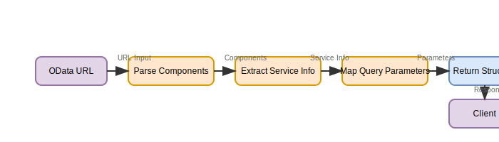
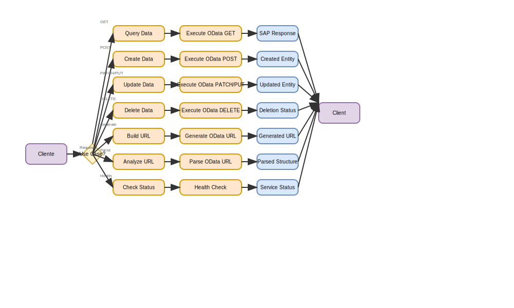

# SAP OData Middleware

## 📋 Overview

A FastAPI-based middleware service that provides a REST API for executing SAP OData operations. This service acts as a bridge between client applications and SAP systems, offering simplified OData URL generation, parsing, and execution capabilities.

## 🚀 Features

- **OData Request Execution**: Execute OData requests with SAP authentication
- **URL Generation**: Build complete OData URLs from parameters
- **URL Parsing**: Analyze and parse OData URLs into components
- **Navigation Properties**: Support for complex navigation paths
- **Multiple Response Formats**: JSON and XML response handling
- **Error Handling**: Comprehensive error management and logging
- **Authentication**: Support for Basic and Bearer token authentication
- **Testing**: Complete test suite with real SAP entity examples

## 🏗️ Architecture

### System Flow

```
Client Application → FastAPI → Business Logic → SAP Authentication → SAP OData System
```

### Key Components

- **FastAPI Application**: Main API gateway with versioned endpoints
- **Business Logic Layer**: Request validation, URL building, and response processing
- **SAP Authentication**: Credential management and header generation
- **Response Processing**: JSON/XML parsing and formatting
- **Error Handling**: Comprehensive error management
- **Logging**: Google Cloud Logging integration

## 📊 Visual Documentation

### API Flow Diagram

The following diagram shows the basic flow of each endpoint in the SAP OData Middleware API:


### Detailed Endpoint Flows

#### Execute OData Flow


#### Generate URL Flow


#### Parse URL Flow



### Use Cases



### Error Handling Flow


### Endpoint Summary

| Endpoint              | Método | Función        | Entrada                    | Salida              |
| --------------------- | ------ | -------------- | -------------------------- | ------------------- |
| `/helpcheck`          | GET    | Health Check   | Ninguna                    | Estado del servicio |
| `/execute-odata`      | POST   | Ejecutar OData | Request estructurado o URL | Respuesta de SAP    |
| `/generate-odata-url` | POST   | Generar URL    | Parámetros estructurados   | URL OData completa  |
| `/parse-odata-url`    | GET    | Parsear URL    | URL OData                  | Estructura parseada |

For more detailed flow diagrams and technical documentation, see `app/docs/API_FLOW_DIAGRAM.md`.

## 🛠️ Installation

### Prerequisites

- Python 3.12+
- SAP system access
- Google Cloud Platform (for logging)

### Setup

```bash
# Clone the repository
git clone <repository-url>
cd odata_middleware

# Install dependencies
pip install -r requirements.txt

# Set environment variables
export SAP_USERNAME="your_sap_username"
export SAP_PASSWORD="your_sap_password"
export SAP_CLIENT="100"
export SAP_LANGUAGE="EN"
```

## 🚀 Usage

### Starting the Service

```bash
# Development
uvicorn app.main:app --reload

# Production
uvicorn app.main:app --host 0.0.0.0 --port 8000
```

### API Endpoints

#### 1. Execute OData Request

```http
POST /api/v1/execute-odata
```

**Example Request:**

```json
{
  "http_method": "GET",
  "base_url": "https://your-sap-system.com",
  "service_name": "API_BUSINESS_PARTNER_QAS_220",
  "source_entity": "A_BusinessPartner",
  "source_key": "12345",
  "select": "BusinessPartner,BusinessPartnerFullName",
  "filter": "SearchTerm2 eq '12345'"
}
```

#### 2. Generate OData URL

```http
POST /api/v1/generate-odata-url
```

#### 3. Parse OData URL

```http
GET /api/v1/parse-odata-url?full_url={url}
```

#### 4. Health Check

```http
GET /api/v1/helpcheck
```

## 🧪 Testing

### Running Tests

```bash
# Run all tests
pytest

# Run with coverage
pytest --cov=app

# Run specific test file
pytest tests/test_middleware_core.py
```

### Test Configuration

The test suite uses:

- **Real SAP Entity**: Business Partner (`A_BusinessPartner`)
- **Mock Authentication**: Global SAP auth mocking
- **Comprehensive Coverage**: Core functionality, navigation, errors, responses

See `tests/README.md` for detailed testing information.

## 📚 Documentation

### API Documentation

- **Postman Examples**: `docs/POSTMAN_EXAMPLES.md`
- **Navigation Properties**: `docs/NAVIGATION_PROPERTY_EXAMPLES.md`

### Development Documentation

- **Test Documentation**: `tests/README.md`

## 🔧 Configuration

### Environment Variables

| Variable       | Description       | Default  |
| -------------- | ----------------- | -------- |
| `SAP_USERNAME` | SAP username      | Required |
| `SAP_PASSWORD` | SAP password      | Required |
| `SAP_CLIENT`   | SAP client ID     | `100`    |
| `SAP_LANGUAGE` | SAP language      | `EN`     |
| `SAP_AUTH_URL` | SAP auth endpoint | Optional |

### API Configuration

- **Base Path**: `/api/v1`
- **Version**: `1.0.0`
- **Documentation**: `/docs` (Swagger UI)
- **Alternative Docs**: `/redoc` (ReDoc)

## 🚨 Error Handling

The middleware handles various error scenarios:

- **422 Unprocessable Entity**: Validation errors
- **401 Unauthorized**: Authentication failures
- **403 Forbidden**: Insufficient permissions
- **404 Not Found**: Entity not found
- **503 Service Unavailable**: SAP system unavailable

## 📊 Logging

### Google Cloud Logging

The service integrates with Google Cloud Logging for:

- Request/response logging
- Error tracking
- Performance monitoring
- Audit trails

### Log Format

```json
{
  "method": "POST",
  "url": "/api/v1/execute-odata",
  "status_code": 200,
  "client_ip": "127.0.0.1",
  "responseId": "uuid",
  "timestamp": "2024-01-01T00:00:00Z"
}
```

## 🔒 Security

### Authentication

- **Basic Authentication**: Username/password
- **Bearer Token**: OAuth2 token support
- **Header Management**: Automatic SAP headers

### Security Features

- Input validation
- SQL injection prevention
- CORS configuration
- Trusted host middleware

## 🚀 Deployment

### Docker

```dockerfile
FROM python:3.12-slim
WORKDIR /app
COPY requirements.txt .
RUN pip install -r requirements.txt
COPY . .
CMD ["uvicorn", "app.main:app", "--host", "0.0.0.0", "--port", "8000"]
```

### Google Cloud Run

See `devops/terraform/google-cloud/cloud_run/` for Terraform configuration.

## 🤝 Contributing

### Development Setup

1. Fork the repository
2. Create a feature branch
3. Make your changes
4. Add tests for new functionality
5. Update documentation
6. Submit a pull request

### Code Standards

- Follow PEP 8 style guidelines
- Add type hints to functions
- Include docstrings for all functions
- Write comprehensive tests
- Update documentation

## 📞 Support

### Getting Help

1. Check the documentation in `docs/`
2. Review the test examples
3. Check the API documentation at `/docs`
4. Open an issue for bugs or feature requests

### Common Issues

- **Authentication Errors**: Verify SAP credentials
- **Validation Errors**: Check request format
- **Connection Errors**: Verify SAP system availability
- **Test Failures**: Ensure environment variables are set

## 📄 License

This project is licensed under the MIT License - see the LICENSE file for details.

## 🔄 Version History

- **v1.0.0**: Initial release with core OData functionality
- **v1.1.0**: Added navigation property support
- **v1.2.0**: Enhanced error handling and logging
- **v1.3.0**: Improved testing and documentation

## 🙏 Acknowledgments

- SAP for OData protocol
- FastAPI for the web framework
- Google Cloud for logging infrastructure
- The open-source community for various dependencies
