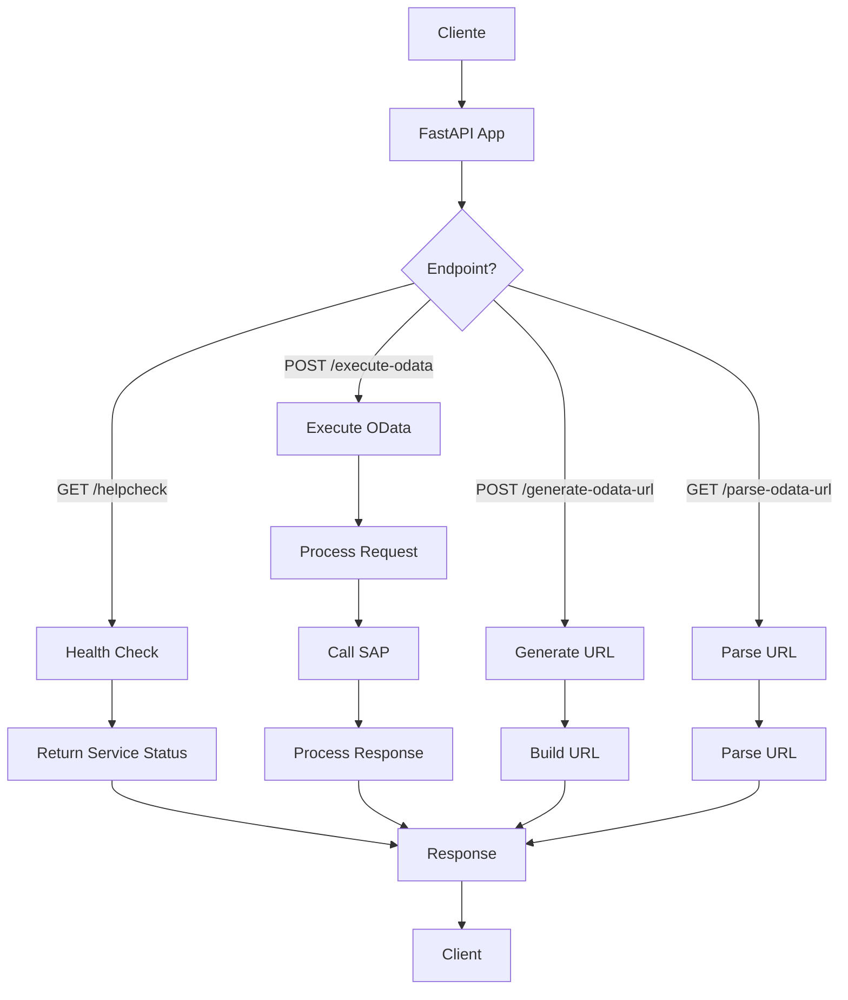
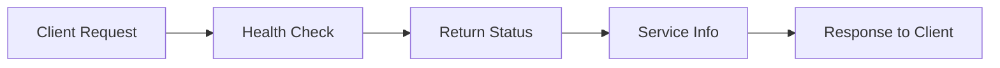
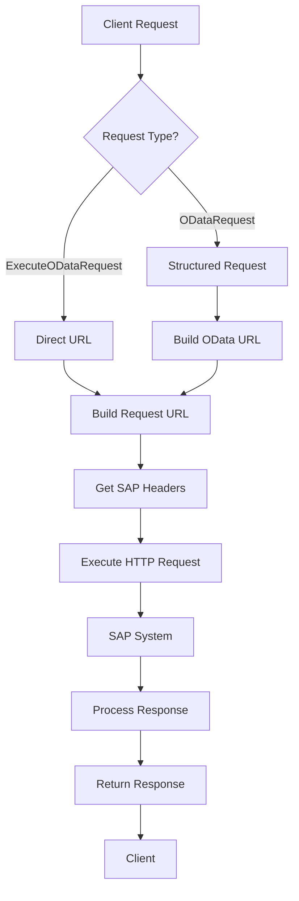
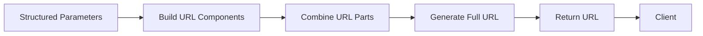
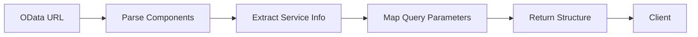
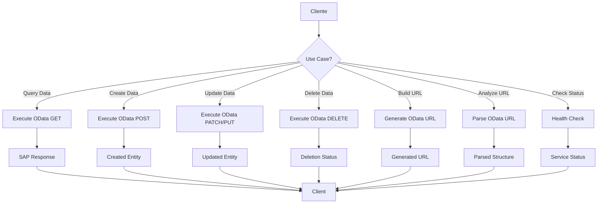
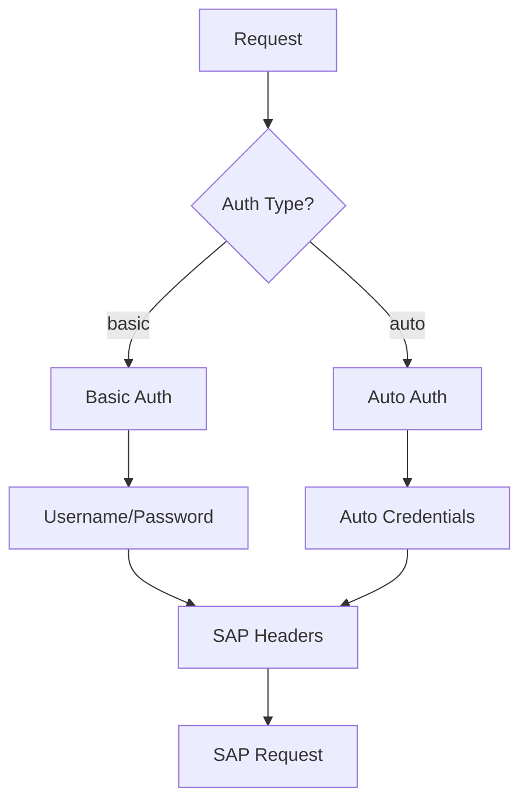
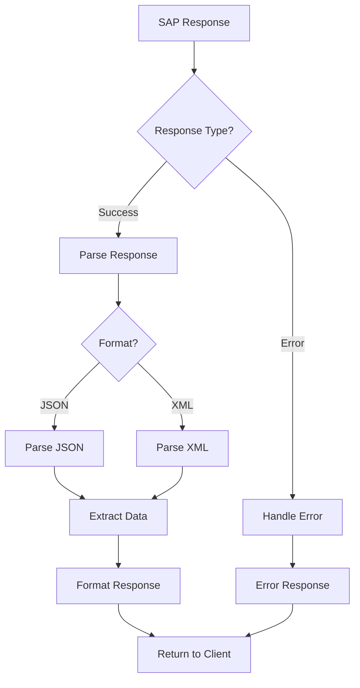
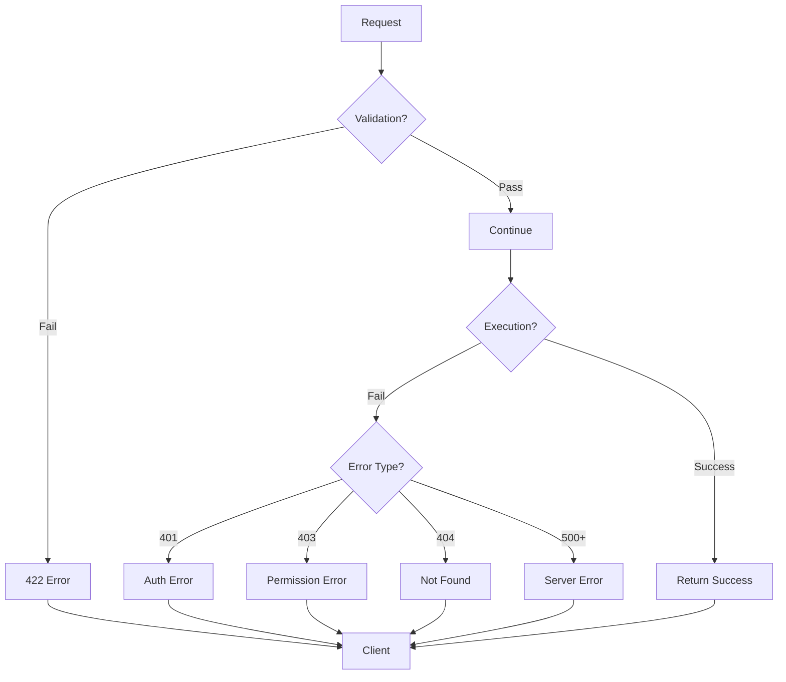
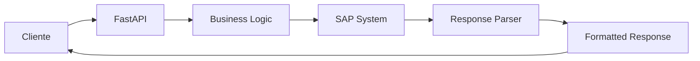

# SAP OData Middleware - Diagrama de Flujo Básico

## 📊 Flujo General del API

## 🔄 Flujo Detallado por Endpoint

### 1. Health Check (`GET /helpcheck`)

**Funcionalidad:**

- Verifica que el servicio esté activo
- Retorna información del estado del sistema
- No requiere parámetros
- Respuesta inmediata

### 2. Execute OData (`POST /execute-odata`)

**Funcionalidad:**

- Ejecuta peticiones OData a SAP
- Soporta requests estructurados y URLs directas
- Maneja autenticación automática
- Procesa respuestas JSON/XML
- Maneja errores de SAP

### 3. Generate OData URL (`POST /generate-odata-url`)

**Funcionalidad:**

- Convierte parámetros estructurados en URL OData
- Maneja navegación simple y compleja
- Incluye todos los parámetros de consulta
- Retorna URL lista para usar

### 4. Parse OData URL (`GET /parse-odata-url`)

**Funcionalidad:**

- Analiza URLs OData completas
- Extrae componentes individuales
- Valida estructura de la URL
- Retorna información estructurada

## 🎯 Casos de Uso Principales

## 🔐 Autenticación y Seguridad

## 📊 Procesamiento de Respuestas

## 🚨 Manejo de Errores

## 📋 Resumen de Endpoints

| Endpoint              | Método | Función        | Entrada                    | Salida              |
| --------------------- | ------ | -------------- | -------------------------- | ------------------- |
| `/helpcheck`          | GET    | Health Check   | Ninguna                    | Estado del servicio |
| `/execute-odata`      | POST   | Ejecutar OData | Request estructurado o URL | Respuesta de SAP    |
| `/generate-odata-url` | POST   | Generar URL    | Parámetros estructurados   | URL OData completa  |
| `/parse-odata-url`    | GET    | Parsear URL    | URL OData                  | Estructura parseada |

## 🔄 Flujo de Datos General

## 🎯 Beneficios del Middleware

- **Simplificación**: Convierte requests complejos en simples
- **Estandarización**: Respuestas consistentes
- **Autenticación**: Manejo automático de credenciales SAP
- **Flexibilidad**: Soporta múltiples formatos de entrada
- **Validación**: Verificación automática de parámetros
- **Error Handling**: Manejo consistente de errores

---

## 📝 Notas

- Todos los endpoints retornan respuestas en formato JSON/XML estándar
- La autenticación se maneja automáticamente
- Los errores se formatean de manera consistente
- El middleware actúa como puente entre clientes y SAP
- Soporta operaciones CRUD completas
- Maneja navegación simple y compleja en OData
